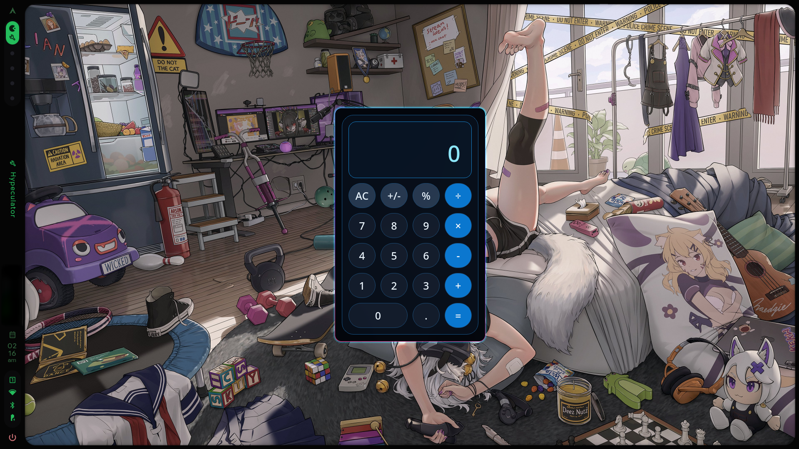

# Hypeculator

Hypeculator is a fast, native desktop calculator for Linux. It uses Python and PySide6, with a compact dark interface and a Decimal-based calculation engine.

## Features

- Four basic operations, decimal input, percentage, sign change, and repeated equals.
- Clear handling of division by zero and recoverable error states.
- Shared calculation logic for keyboard input and on-screen buttons.
- Responsive compact window with a wide zero key.
- Linux desktop entry and `hypeculator` command-line launcher.

## Screenshot



## Requirements

- Python 3.11 or later
- PySide6

## Run from source

```zsh
git clone git@github.com:oxyth8/hypeculator.git
# or git clone https://github.com/oxyth8/hypeculator.git
cd hypeculator
python -m venv .venv
.venv/bin/python -m pip install -e .
.venv/bin/hypeculator
```

Activating the virtual environment is optional when using its explicit launcher. A regular installed package provides the public command:

```zsh
hypeculator
```

For development, this also works from the project root:

```zsh
.venv/bin/python -m calculator
```

## Keyboard controls

| Key | Action |
| --- | --- |
| `0`–`9` | Enter a number |
| `.` or `,` | Enter a decimal separator |
| `+`, `-`, `*`, `/` | Select an operation |
| Enter, Return, `=` | Calculate |
| Delete | Clear the calculation (`AC`) |
| Escape | Close Hypeculator |

Numpad number and operator keys use the same calculation actions.

## Desktop integration

The packaged desktop entry is [packaging/linux/hypeculator.desktop](packaging/linux/hypeculator.desktop). System packages can install it to `/usr/share/applications/` and install [assets/logo/hypeculator.png](assets/logo/hypeculator.png) to `/usr/share/icons/hicolor/512x512/apps/`.

For a source checkout, `scripts/install-desktop-entry` installs a user-level launcher, icon, and `hypeculator` command. `scripts/uninstall-desktop-entry` removes only the files created for that checkout. These scripts do not modify shell or compositor configuration files.

## Optional Hyprland rule

Hypeculator does not require Hyprland. To keep it floating at a compact size, users of recent Hyprland versions can add this optional rule to their own configuration:

```conf
windowrule {
    match:class = ^(hypeculator)$
    float = on
    center = on
    size = 360 560
}
```

## License

Hypeculator is licensed under the [MIT License](LICENSE).
